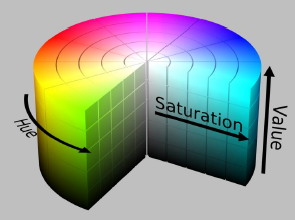
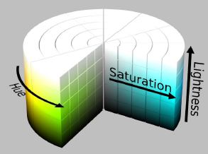
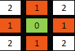
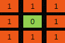

# Visione Artificiale

## Indice

- [Visione Artificiale](#visione-artificiale)
  - [Indice](#indice)
- [Immagini](#immagini)
  - [RGB](#rgb)
  - [HSV/HSL](#hsvhsl)
  - [Istogramma](#istogramma)
  - [Lookup Table (LUT)](#lookup-table-lut)
  - [Binarizzazione](#binarizzazione)
  - [Trasformazioni geometriche](#trasformazioni-geometriche)
  - [Trasformazioni affini](#trasformazioni-affini)
  - [Problemi delle trasformazioni \*](#problemi-delle-trasformazioni-)
  - [Domande](#domande)
- [Calibrazione Telecamera](#calibrazione-telecamera)
  - [Parametri estrinseci](#parametri-estrinseci)
  - [Parametri intrinseci](#parametri-intrinseci)
  - [Calibrazione](#calibrazione)
  - [Domande](#domande-1)
- [Filtri](#filtri)
  - [Filtri lineari](#filtri-lineari)
    - [Normalizzazione](#normalizzazione)
    - [Complessità computazionale](#complessità-computazionale)
    - [Filtri separabili](#filtri-separabili)
    - [Riduzione del rumore](#riduzione-del-rumore)
    - [Sharpening](#sharpening)
  - [Estrazione dei bordi](#estrazione-dei-bordi)
    - [Difference of Gaussians (DoG)](#difference-of-gaussians-dog)
    - [Filtri derivativi](#filtri-derivativi)
    - [Gradiente](#gradiente)
    - [Canny edge detector](#canny-edge-detector)
    - [Laplaciano](#laplaciano)
      - [Laplacian of Gaussian (LoG)](#laplacian-of-gaussian-log)
  - [Filtri non lineari](#filtri-non-lineari)
    - [Median filter](#median-filter)
  - [Domande](#domande-2)
- [Analisi di immagini binarie](#analisi-di-immagini-binarie)
  - [Immagini binarie](#immagini-binarie)
    - [Topologia digitale](#topologia-digitale)
    - [Metriche discrete](#metriche-discrete)
  - [Trasformata distanza](#trasformata-distanza)
  - [Estrazione del contorno](#estrazione-del-contorno)
  - [Componenti connesse](#componenti-connesse)
    - [Etichettatura delle componenti connesse](#etichettatura-delle-componenti-connesse)
  - [Morfologia matematica](#morfologia-matematica)
    - [Elemento strutturante](#elemento-strutturante)
    - [Operazioni morfologiche](#operazioni-morfologiche)
  - [Domande](#domande-3)
- [Movimento nei video](#movimento-nei-video)
  - [Modello del background](#modello-del-background)
  - [Tracking di oggetti](#tracking-di-oggetti)
    - [Mean-shift](#mean-shift)
  - [Domande](#domande-4)
- [Riconoscimento di oggetti](#riconoscimento-di-oggetti)
  - [Confronto diretto](#confronto-diretto)
  - [Template matching](#template-matching)
  - [Estrazione caratteristiche](#estrazione-caratteristiche)
  - [Machine learning](#machine-learning)
  - [Deep learning](#deep-learning)
    - [Convolutional neural Network (CNN)](#convolutional-neural-network-cnn)
  - [Domande](#domande-5)

# Immagini

## RGB
---
L'RGB è un modello di visualizzazione dei colori additivo, cioè si basa sulla somma della luminosità dei tre colori primari (rosso, verde, blu) per ottenere tutti i colori.

Ogni colore rappresenta un punto in uno spazio a tre dimensioni.

E' molto utilizzato in informatica perché rende semplice la rappresentazione dei colori.

Non raggruppa spazialmente i colori percepiti come simili dall'uomo.

## HSV/HSL
---
L'HSV e l'HSL sono modelli basati su Hue, Saturation, Value o Lightness.

L'asse verticale comprende i grigi, dal nero (luminosità 0) al bianco (luminosità 1).

I colori si trovano attorno al cilindro con saturazione 1 e luminosità 1 (HSV) o 0.5 (HSL).

Sono utilizzati per riconoscere gli oggetti nelle immagini.

Raggruppano spazialmente i colori percepiti come simili dall'uomo.

Non sono adatti ad una descrizione quantitativa dei colori.

## Istogramma
---
L'istogramma di un'immagine grayscale indica il numero di pixel dell'immagine per ciascun livello di grigio.

Con un istogramma si può evincere se un immagine è poco contrastata (valori condensati in una zona) o se è chiara/scura.

L'equalizzazione dell'istogramma permette di migliorarne il contrasto.

E' utilizzato per schiarire/scurire un'immagine.

Può essere utilizzato anche per separare gli oggetti dallo sfondo, se entrambi sono omogenei.

## Lookup Table (LUT)
---
La lookup table è utilizzata se il numero di colori nell'immagine è inferiore al numero di pixel per aumentare l'efficienza delle operazioni sui pixel.

E' un array in cui si mappano i valori di output per ogni input.

Viene utilizzata per:

- Convertire immagini grayscale in RGB
- Binarizzazione
- Equalizzazione di un istogramma.

## Binarizzazione
---
La binarizzazione viene usata per separare gli oggetti dallo sfondo.

Si usa una soglia globale se oggetti e sfondo sono uniformi.

Altrimenti si utilizza una soglia locale determinata per ogni pixel in base al suo intorno.

## Trasformazioni geometriche
---
Le trasformazioni geometriche sono trasformazioni che si applicano alle coordinate e non ai valori dei pixel.

Con il mapping diretto si va a mappare ogni pixel della vecchia immagine nella nuova immagine.

Il mapping inverso è una trasformazione che parte dalla destinazione e ritorna alla sorgente.

## Trasformazioni affini
---
Una trasformazione affine può essere rappresentata come moltiplicazione per una matrice (fattore di scala + rotazione) e somma di un vettore (traslazione).

Si possono combinare più trasformazioni affini moltiplicando fra loro le corrispondenti matrici.

A differenza delle trasformazioni proiettive preserva il parallelismo fra rette.

## Problemi delle trasformazioni *
---

Problemi e relative soluzioni:

- Valore dei pixel fuori dalla nuova immagine
  - Colore di background costante
  - Copia del pixel più vicino
  - Riflessione dei pixel dell'immagine
  - Replica dell'immagine
  - Lascia il valore già presente nell'immagine destinazione
- Valore dei pixel nelle coordinate non intere
  - Il metodo più semplice è scegliere il valore del pixel più vicino
  - L'interpolazione, invece, stima il valore del pixel applicando una funzione ai pixel in un intorno 
- Buchi nella nuova immagine

## Domande
---

- Descrivere lo spazio colore [RGB](#rgb) e illustrarne brevemente vantaggi e svantaggi.
- Che cos’è l’[istogramma](#istogramma) di un’immagine digitale? A cosa può servire?
- Cosa si intende per [Look Up Table (LUT)](#lookup-table-lut)? A cosa può servire?
- Quali problemi presenta l’applicazione di una [trasformazione affine](#trasformazioni-affini) a un’immagine tramite mapping diretto? Come è possibile risolverli?
- Che cosa si intende per segmentazione degli oggetti dal background? In quali casi è un’[operazione semplice](#istogramma)? In quali casi può essere [molto complicata](#binarizzazione)? [Componenti connesse](#componenti-connesse)
- Descrivere gli spazi colore [HSL/HSV](#hsvhsl) e illustrarne brevemente vantaggi e svantaggi.

# Calibrazione Telecamera

## Parametri estrinseci
---
Poiché il sistema della camera non è lo stesso della scena 3D, è necessario trasformare le coordinate 3D della scena in coordinate 2D della camera.

Per farlo si utilizzano i parametri estrinseci:

- Una matrice di rotazione $R$ (ottenuta a partire da tre angoli)
- Un vettore di traslazione $t$ (tre componenti)

## Parametri intrinseci
---
Per determinare la trasformazione dalla scena 3D all'immagine è necessario conoscere i parametri intrinseci della camera:

- Lunghezza focale $f$
- Centro dell'immagine $(c_x, c_y)$
- La relazione tra la dimensione dei pixel e l'unità di misura fisica $(s_x, s_y)$ (quanto misura un pixel)

## Calibrazione
---
La calibrazione consiste nel determinare i parametri intrinseci ed estrinseci della camera.

Conoscendo un certo numero di corrispondenze tra punti 3D della scena e punti 2D dell'immagine è possibile calcolare i parametri estrinseci e intrinseci.

Di solito si utilizza una scacchiera per calibrare la camera poiché è semplice individuare al suo interno un insieme di punti noti.

## Domande
---
Che cosa sono i [parametri estrinseci](#parametri-estrinseci) del “pinhole camera model”?

# Filtri

Un filtro $F$ è una matrice quadrata $m$ ⨉ $m$ dispari.

## Filtri lineari
---
Un filtro lineare è un **operazione locale** (il valore del pixel risultato dipende da un intorno del pixel di partenza) in cui il valore di un pixel è calcolato come somma pesata dei valori dei pixel di un intorno del pixel di partenza.

### Normalizzazione
---
Se i coefficienti del filtro sono tutti $≥0$ e si vuole mantenere lo stesso range di valori dell'immagine di partenza si normalizza il filtro dividendo per la somma dei coefficienti.

### Complessità computazionale
---
La complessità computazionale di un filtro lineare è $m^2$ moltiplicazioni e somme per ciascun pixel del risultato.

E' possibile ridurla notevolmente, portandola a $2m$ per pixel, se il filtro è separabile.

### Filtri separabili
---
Un filtro è separabile se la matrice $F$ può essere scritta come prodotto di un vettore colonna per un vettore riga.

In questo modo si può applicare il filtro $F$$x$ e successivamente $F$$y$.

>### Correlazione
>
>$I'=I⨂F$
>
>### Convoluzione
>
>$I'=I*F$
>
>Si ottiene ribaltando il filtro sui due assi.

### Riduzione del rumore
---

- **Box filter** → riduce il rumore "sfocando" l'immagine.
- **Gaussian filter** → risolve il problema della creazione di artefatti utilizzando pesi che diminuiscono spostandosi dal centro verso l'esterno del filtro.

### Sharpening
---
Un filtro di sharpening è un filtro che aumenta la nitidezza di un'immagine.

1. Si calcola l'immagine blurrata e la si sottrae all'originale.
    
    $M=I-I*F$$b$

2. Si moltiplica il risultato ottenuto per un parametro $k$ (che determina l'intensità dell'effetto) e si somma all'originale.

    $I'=I+k$ . $M$

## Estrazione dei bordi
---
Considerando un'immagine grayscale come una funzione $f$ i bordi si trovano in corrispondenza di cambiamenti rapidi di $f$.

### Difference of Gaussians (DoG)
---
Il filtro gaussiano riduce le alte frequenze nell'immagine:

$I*G$$σ$ = basse frequenze

Sottraendo il risultato dello smooth dall'immagine originale si evidenziano le zone caratterizzate da cambiamenti rapidi fra pixel chiari e scuri:

$I-I*G$$σ$ = alte frequenze

Dati due filtri $G$$σ1$ e $G$$σ2$, la differenza $(I*G$$σ1$$)-(I*G$$σ2$$)$ evidenzia un certo range di frequenze nell'immagine e dopo aver normalizzato emergono i bordi.

Per la proprietà distributiva della [convoluzione](#convoluzione) il filtro DoG si può scrivere come:

> $I*(G$$σ1$$-G$$σ2$$)$

### Filtri derivativi
---
Facendo le derivate parziali sugli assi $x$ e $y$ si ottengono le **alte frequenze** nell'immagine, ma poiché sono influenzate dal rumore dell'immagine si applica prima un filtro di smooth.

I principali filtri derivativi $3$⨉$3$ (in ordine decrescente di errori) sono: 

- Prewitt → il più efficiente
- Sobel → il più usato
- Scharr → migliore invarianza rotazionale

### Gradiente
---
Il gradiente in un punto è il vettore che ha per componenti le sue derivate parziali.

In un punto di un'immagine indica la direzione di maggior variazione dell'immagine nel punto.

Osservando l'orientazione del gradiente si evince che il bordo di un'immagine è ortogonale al gradiente.

Si può impostare una soglia al modulo del gradiente per selezionare i bordi, ma ciò può produrre:

- bordi non connessi
- bordi spuri
- bordi spessi

### Canny edge detector
---
L'algoritmo di Canny è formato da quattro step:

1. Gaussian blur dell'immagine
2. Calcolo del gradiente per ogni pixel
3. Soppressione dei non massimi in direzione ortogonale al bordo
   
    Serve ad eliminare dall'immagine del modulo del gradiente i pixel in cui il modulo del gradiente non è massimo locale rispetto all'orientazione del gradiente.

4. Selezione dei bordi significativi con l'isteresi

    L'immagine viene binarizzata utilizzando due soglie T1 e T2 con T1 > T2.

    Inizialmente si considerano solo i pixel con il modulo del gradiente superiore a T1.

    Successivamente si considerano anche quelli con modulo superiore a T2 se adiacenti a pixel già considerati.

### Laplaciano
---
Il Laplaciano è la somma delle due derivate parziali seconde in un punto.

In un immagine con un bordo sufficientemente contrastato il laplaciano è:

- zero lontano dal bordo
- zero in corrispondenza del bordo
- positivo vicino al bordo (dal lato in cui i pixel diventano più chiari avvicinandosi al bordo)
- negativo vicino al bordo (dal lato opposto)

#### Laplacian of Gaussian (LoG)

---
Laplaciano a cui è stato applicato un smooth gaussiano e, grazie alla proprietà associativa, si può ottenere calcolando il laplaciano
della funzione gaussiana:

$I*(S$$G$ $*$ $F$$∆$$)$

## Filtri non lineari
---

### Median filter
---
Il median filter è un operazione locale in cui il valore di ciascun pixel è la mediana dei valori dei pixel nell'intorno del pixel considerato.

Può ridurre alcuni tipi di rumore preservando maggiormente i bordi rispetto ai filtri di smooth lineari.

## Domande
---

- Si illustri la [complessità computazionale](#complessità-computazionale) della convoluzione di un’immagine con un filtro e si descrivano brevemente una o più tecniche per migliorare l’efficienza di tale operazione.
- Descrivere gli [operatori di Sobel](#filtri-derivativi) e illustrarne brevemente alcune possibili applicazioni.
- Cosa si intende per [correlazione e convoluzione](#filtri-separabili)? Quali caratteristiche hanno in comune? Quali sono le differenze?
- Cosa si intende generalmente per [sharpening](#sharpening) nell’elaborazione delle immagini?
- Descrivere sinteticamente il metodo [“Canny edge detector”](#canny-edge-detector).
- Descrivere cosa si intende con “convoluzione di un’immagine con un [filtro digitale](#filtri-lineari)”.

# Analisi di immagini binarie

## Immagini binarie
---
Le immagini binarie sono immagini che hanno solo due colori:

- Foreground $F$ → **255**
- Background $F$* → **0**

Sono alla base del rilevamento e del riconoscimento di oggetti nelle immagini.

### Topologia digitale
---
La topologia digitale è una disciplina che studia le proprietà e le caratteristiche topologiche di un immagine (componenti connesse, bordi).

### Metriche discrete
---
Le metriche discrete stabiliscono quali pixel sono *vicini* di un pixel, ovvero quelli che hanno distanza 1 dal pixel considerato.

I tipi più comuni sono:

- Distanza d4 (City block , Manhattan)
  
  

- Distanza d8 (Chessboard , Chebyshev)
  
  

## Trasformata distanza
---
La trasformata distanza di $F$ rispetto a $F$* è un'immagine in cui il valore dei pixel è la distanza di ciascun pixel da $F$*.

Per calcolare la trasformata distanza con la metrica d4 si effettuano due scansioni dell'immagine:

- Diretta → dall'alto verso il basso, da sinistra a destra
- Inversa → dal basso verso l'alto, da destra a sinistra

Durante le scansioni i pixel vengono trasformati e quelli dello sfondo messi a 0.

La trasformata distanza può essere utilizzata per:

- Misurazioni geometriche
- Generare lo scheletro di un oggetto
- Template matching
- Robotica (aggirare ostacoli)

## Estrazione del contorno
---
Il contorno di $F$ è dato dalla sequenza ordinata di pixel che hanno distanza unitaria da $F$*.

Per l'estrazione del contorno di solito si utilizza una tecnica di inseguimento che percorre il bordo nella stessa direzione fino a tornare al pixel di partenza.

## Componenti connesse
---
Un percorso di lunghezza $n$ è una sequenza di n pixel vicini.

Una componente connessa è un sottoinsieme di $F$ tale che, presi due qualsiasi dei suoi pixel, esiste un percorso tra di loro appartenente a $F$.

### Etichettatura delle componenti connesse
---
L'etichettatura delle componenti connesse consiste nell'individuare ed etichettare automaticamente le componenti connesse di un'immagine:

- Si scorre l'immagine e per ogni pixel di foreground `p` si considerano i pixel già visitati:
  - se nessuno è etichettato si assegna una nuova etichetta a `p`
  - se uno è etichettato si assegna la stessa etichetta a `p`
  - se più di uno è etichettato si annotano le equivalenze e si assegna a `p` una delle etichette
- Per ogni insieme di etichette equivalenti se ne definisce una e si effettua un'altra scansione

## Morfologia matematica
---
La morfologia matematica è una tecnica di analisi ed elaborazione di immagini binarie derivata dalla teoria degli insiemi.

Serve a:

- Estrarre informazioni per descrivere la forma degli oggetti
- Rimuovere particolari irrilevanti dagli oggetti

### Elemento strutturante
---
Immagine binaria con dimensioni dispari utilizzata come parametro nelle operazioni morfologiche.

### Operazioni morfologiche
---
Gli operatori principali alla base delle operazioni morfologiche sono:

- Dilatazione: $F⨁S=\{q|(𝑆^r)$$q$$∩F≠∅\}$
  - La nuova immagine è l’insieme dei pixel tali che, traslando in essi $S^r$, almeno uno dei suoi
elementi è sovrapposto a $F$
- Erosione: $F$⊖$S=\{q|(𝑆)$$q$$⊆F\}$
  - La nuova immagine è l’insieme dei pixel tali che, traslando in essi $S$, l’intero elemento strutturante è contenuto in $F$

Da cui si ottengono le seguenti operazioni morfologiche:

- Apertura:  $F∘S=(F$⊖$S)⨁S$
  - Erosione seguita da dilatazione
  - Separa oggetti debolmente connessi e rimuove regioni piccole
  - Si utilizza come elemento strutturante un elemento che è più
grande della regione da eliminare.
- Chiusura: $F•S=(F⨁S)$ ⊖ $S$
  - Dilatazione seguita da erosione
  - Riempie buchi e rafforza la connessione di regioni unite debolmente
  - Si utilizza come elemento strutturante un elemento che è più
grande dei buchi da chiudere.

## Domande
---

- Come è possibile, con la [morfologia matematica](#morfologia-matematica), “riempire” piccoli “buchi” in un’immagine?
- Definire formalmente l’operatore di [apertura](#morfologia-matematica) della morfologia matematica e illustrarne brevemente il funzionamento.
- Definire formalmente i seguenti termini nel contesto della [topologia digitale](#topologia-digitale): vicini, percorso, componente connessa
- Descrivere il funzionamento della [trasformata distanza](#trasformata-distanza).
- Descrivere il funzionamento dell’algoritmo di [etichettatura delle componenti connesse](#etichettatura-delle-componenti-connesse).
- Definire formalmente i due operatori di base della [morfologia matematica](#operazioni-morfologiche) e illustrarne brevemente il funzionamento.

# Movimento nei video

L'obiettivo è rilevare gli oggetti in movimento nei video.

1. Innanzitutto viene costruito un modello del background a partire da un certo numero di frame iniziali
2. In ogni nuovo frame i pixel che differiscono dal modello del background sono considerati oggetti in movimento
3. Il modello del background viene aggiornato in base ai nuovi frame

Per ottenere i pixel che differiscono tra i frame si possono considerare quelli la cui differenza di valore nei frame è maggiore di una certa soglia.

## Modello del background
---
Il modello per i pixel del background è scelto in base al tipo di sfondo:

- Quando la variabilità dei pixel è poca la media degli ultimi frame è sufficiente.
- Quando è maggiore si utilizza una gaussiana, stimando media e varianza dei precedenti frame
- Quando le variazioni sono periodiche la distribuzione può essere multimodale: si modella ogni pixel con una **Mixture of Gaussians (MoG)**

## Tracking di oggetti
---
### Mean-shift
---
Il mean-shift è un algoritmo iterativo (si ripete) per determinare i massimi locali di una funzione di densità di probabilità a partire da un insieme di campioni.

Si può applicare al tracking di un oggetto:

- Sia $W$ la regione che nel frame precedente conteneva l'oggetto
- Sia $C$ una mappa di confidenza che indica, per ogni pixel del nuovo frame, la probabilità che tale pixel appartenga all'oggetto
- Ad ogni iterazione si calcola la media pesata di $C$ in $W$ e si sposta $W$ di conseguenza
- Ci si ferma quando la media converge o si raggiunge il massimo numero di iterazioni.

La mappa di confidenza può essere ottenuta analizzando alcune caratteristiche dell'oggetto come il colore o la luminosità in grayscale.

## Domande

- Si descriva l’algoritmo [Mean-Shift](#mean-shift).

# Riconoscimento di oggetti

## Confronto diretto
---
Il confronto diretto tra immagini, ovvero pixel-a-pixel, non è efficace per le seguenti ragioni:

- Differenze di traslazione, rotazione, scala, prospettiva e illuminazione
- Deformazione e variabilità degli oggetti
- Presenza di rumore nelle immagini

## Template matching
---
Nel template matching si definisce un pattern modello (template), cioè una piccola immagine che viene cercata all'interno dell'immagine misurandone il grado di somiglianza (matching) in tutte le possibili posizioni.

Le tecniche di misura della somiglianza si basano sul confronto di:

- Pixel
- Bordi
- Orientazione del gradiente

Alcuni esempi pratici sono:

- Somma delle differenze al quadrato
- Correlazione
- Coefficiente di correlazione

Tutte e tre contemplano anche la versione normalizzata.

## Estrazione caratteristiche
---
Per ridurre la quantità di informazioni di un'immagine si possono rappresentare le parti più rilevanti sotto forma di vettori numerici, che vengono poi utilizzati per riconoscere gli oggetti nelle immagini. 

## Machine learning
---
Un sistema di machine learning durante la fase di training apprende a partire da degli esempi.

Poi nella fase di inference è in grado di gestire anche nuovi dati dello stesso dominio applicativo.

## Deep learning
---
Il deep learning è una tipologia di machine learning in cui la scelta delle feature e la classificazione vengono apprese direttamente dagli esempi.

### Convolutional neural Network (CNN)
---
Reti neurali specializzate per immagini e video in cui per ciascuna immagine vengono applicati filtri il cui output viene utilizzato come input per il livello seguente.

Utilizzano connessioni locali e condivisione dei pesi per ridurre il numero di parametri.

## Domande
---

- In cosa consiste il [“template matching”](#template-matching)?
- Perché il [confronto “pixel-a-pixel”](#confronto-diretto) generalmente non è efficace in applicazioni reali di ricerca di un oggetto all’interno di un’immagine?